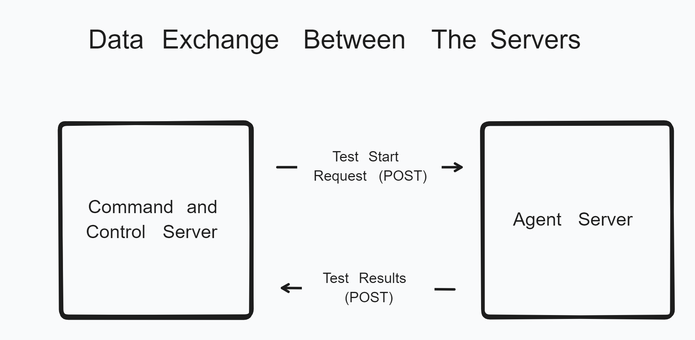

<h1>
Go Load Tester
</h1>

A simple HTTP load tester written in go.

## How this system works
This system works via two parts, the agent server and the command and control server.  
The agent server handles sending the requests and compiling the results.  
The command and control server handles sending the start request to the agent servers, displaying information, and starting / setting up the test.

## Using this System
1. Download all project files from Github
2. Set up the .env files in each file folder (agentServer and commandAndControlServer). (see .env files section)
3. Run the go files in each of the folders

## Setting up the .env files
* Command and Control Server .env File
    1. SERVERS - A list of agent servers. Must be in the format of http(s)://address/. For multiple servers separate the addresses with commas.
    2. webServerAddressCaC - The address of the command and control server
* Agent Server .env File
    1. webServerAddressAgent - The address of the agent server
    2. commandAndControlServerAddress - The address of the command and control server. FILL IN THE yourdomain PART ONLY

## System Diagrams

