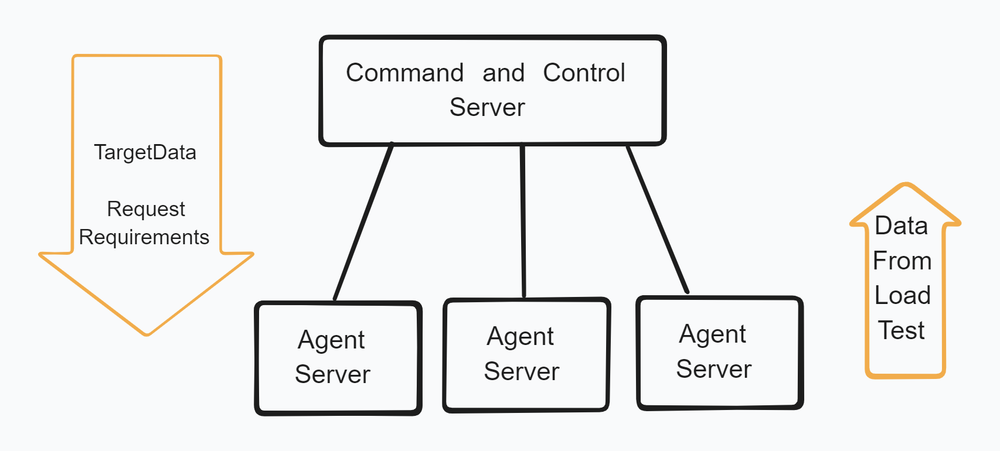

# Go-Loadtest-Me
A load testing service that is written in Go. 

## Technical Description
This is a load testing service that is written in Go. A command server will controll several "agent" servers. These servers will recieve and send requests to to command and controll server to recieve instructions and return data.

The command and controll server will have a list of targets, request that need to be sent, and "agent" servers.

## How to use

## <em>Disclaimer</em>
This system is intended to be a load testing system for web based services. Do not run on any hardware that is not yours or that you do not have the consent to opperate on.